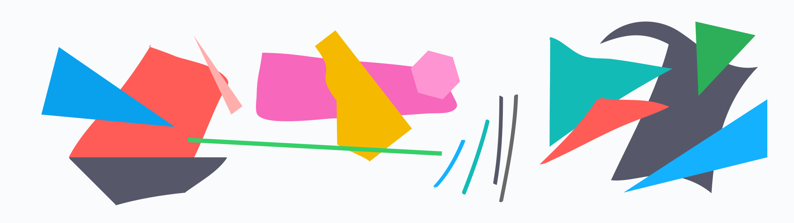

# Abstract wallpapers per colorscheme

A collection of abstract wallpapers (for dual monitors) that can be applied used with any VS Code theme to generate a nice-looking wallpaper
that matches your IDE's theme perfectly.

## Examples




## Wallpaper template creation

Variables with names `color{0..15}`, plus three special ones (`{fore,back}ground` and `cursor`) (which correspond to _wal_ color names) are declared in a template SVG file using _{{mustache}}_ templates.

The wallpaper is first created in Inkspace, Illustrator or any vector graphics application, using particular colors:

- `FF0000` for bright red (color9) and `880000` for red (color1)
- etc. (for black, red, green, yellow, blue, magenta, cyan, white)

For white, `AAAAAA` is the code (as `888888` is taken by bright black)

- `EEEEEE` is foreground (as `FFFFFF` was taken)
- `BBBBBB` is background
- `CCCCCC` is cursor color

The .svg file is then converted to a template with `maketemplate.fish`

## Usage

To create a .svg (and .png) from a template `.svg.mustache`:

```
./generate.fish <artwork ID> <vscode theme name, as seen in the UI>
```

the artwork ID is the name of the template `.svg.mustache` file, without extensions

-----

As a bonus, the script `./apply.fish` (which takes the same arguments) sets the wallpaper (and creates it before if necessary) using feh
